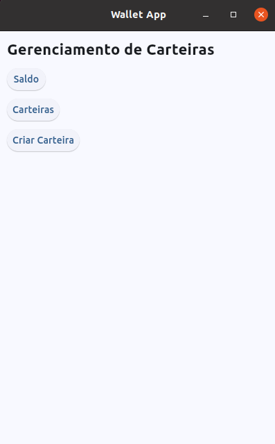

# 🪙 Wallet App - Gerenciador de Carteiras Cripto


Aplicação de gerenciamento de carteiras de criptomoedas desenvolvida em Python com interface gráfica usando Flet. Permite criar, visualizar e gerenciar carteiras frias (cold wallets) de Bitcoin, Ethereum e Litecoin com integração às principais APIs blockchain e cotações em tempo real.

O objetivo é servir tanto como ferramenta prática para gestão de criptomoedas quanto como estudo/portfólio de Python com interface gráfica moderna e integrações com APIs.


## 📌 Visão Geral

A aplicação oferece funcionalidades como:

- 💼 **Gestão de Carteiras Frias**: Criação e gerenciamento de cold wallets
- 🪙 **Multi-Moeda**: Suporte a Bitcoin, Ethereum e Litecoin
- 📊 **Saldo Consolidado**: Visualização de saldo total por tipo de criptomoeda
- 🔐 **Segurança**: Exibição protegida de chaves privadas (toggle show/hide)
- 📱 **QR Codes**: Geração automática de QR codes para recebimento
- 💱 **Cotações Reais**: Preços atualizados em BRL e USD via CoinGecko
- 🔄 **Atualização de Saldo**: Consulta de saldo real na blockchain
- 🎨 **Interface Moderna**: UI responsiva construída com Flet


## 🏗️ Arquitetura da Aplicação

### Interface Principal

```
Menu inicial com botões de navegação
    ↓
Sistema de rotas (routes.py)
    ↓
Views dinâmicas (pages/*)
```

### Fluxo de Criação de Carteira

```
Formulário (create.py)
    ↓
Validação de campos
    ↓
Geração de chaves (se não fornecidas)
    ↓
generic_service.py → bitcoin_service.py / ethereum_service.py / litecoin_service.py
    ↓
Geração de QR Code (qrcode_service.py)
    ↓
Salvamento no banco (ColdWallet model)
    ↓
TinyDB (database_db.json)
```

### Visualização de Saldo

```
Lista de carteiras (list.py)
    ↓
Clique na carteira
    ↓
show.py carrega detalhes
    ↓
Botão "Atualizar Valor"
    ↓
generic_service.py → consulta blockchain via API
    ↓
price_service.py → consulta cotações CoinGecko
    ↓
crypto_to_prices() → converte para BRL/USD
    ↓
Atualização da interface
```

### Camadas da Arquitetura

```
Views (Flet UI - pages/)
    ↓
Services (Lógica de negócio - services/)
    ↓
Models (Entidades ORM - models/)
    ↓
Database (TinyDB - database_db.json)
```

### Fluxo de Dados Típico

```
Usuário interage com View (Flet)
    ↓
View chama Service (se necessário)
    ↓
Service processa lógica e interage com APIs externas
    ↓
Service salva/busca dados via Models
    ↓
Models executam operações no TinyDB
    ↓
Dados retornam pela cadeia inversa
    ↓
View atualiza interface (componentes Flet)
```


## 🏗️ Estrutura do Projeto

```
wallet_app/
├── main.py                         # Aplicação principal Flet com configuração de janela e sistema de rotas
├── routes.py                       # Sistema de roteamento: mapeia URLs para views
│                                   # gerencia navegação e parâmetros de query string
├── database_db.json                # Banco de dados JSON do TinyDB
│                                   # contém todas as tabelas (carteiras, transações, preços)
├── requirements.txt                # Dependências Python do projeto
├── README.md                       # Documentação do projeto
│
├── assets/                         # Recursos estáticos da aplicação
│   ├── qrcodes/                    # Diretório para armazenar QR codes gerados
│   ├── bitcoin.png                 # Ícone do Bitcoin
│   ├── carteira-bitcoin.png        # Imagem ilustrativa de carteira Bitcoin
│   ├── ethereum.png                # Ícone do Ethereum
│   └── litecoin.png                # Ícone do Litecoin
│
├── enums/                          # Enumerações do sistema
│   ├── __pycache__/                # Cache de bytecode Python
│   └── coin_type.py                # Enum que define tipos de criptomoedas (Bitcoin, Ethereum, Litecoin)
│                                   # com propriedades (label, ícone, unidade menor, fator de conversão)
│
├── helpers/                        # Funções auxiliares genéricas
│   ├── __pycache__/                # Cache de bytecode Python
│   └── generics.py                 # Funções utilitárias: icon_control, toggle_button, limit_chars
│
├── i18n/                           # Internacionalização (i18n)
│   ├── __pycache__/                # Cache de bytecode Python
│   └── pt_BR.py                    # Dicionário de traduções em português brasileiro
│
├── models/                         # Modelos de dados (camada de domínio)
│   ├── __pycache__/                # Cache de bytecode Python
│   ├── __init__.py                 # Inicialização do módulo models
│   ├── cold_wallet.py              # Model de carteira fria com métodos CRUD (save, delete, find_by_id, all)
│   │                               # e lógica para garantir geração de QR code
│   ├── crypto_price.py             # Model de preço de criptomoeda (USD/BRL) com cache de 24h
│   │                               # e método needs_update para verificar necessidade de atualização
│   ├── from_wallet.py              # Model de carteira de origem (para transações recebidas)
│   │                               # armazena informações sobre remetente
│   └── transaction.py              # Model de transação com data, valor, observação
│                                   # e relacionamento com cold_wallet e from_wallet
│
├── pages/                          # Páginas/Views da aplicação (camada de apresentação)
│   ├── __pycache__/                # Cache de bytecode Python
│   ├── __init__.py                 # Inicialização do módulo pages
│   ├── home.py                     # Página inicial com menu principal
│   │                               # botões para: saldo, carteiras, criar carteira
│   │
│   └── cold_wallet/                # Páginas específicas de carteiras frias
│       ├── __pycache__/            # Cache de bytecode Python
│       ├── balance.py              # Exibe saldo total agrupado por tipo de criptomoeda
│       │                           # com navegação para lista de carteiras por tipo
│       ├── create.py               # Formulário de criação de carteira com campos opcionais
│       │                           # gera chaves automaticamente se não informadas
│       ├── destroy.py              # Dialog de confirmação para exclusão de carteira
│       │                           # remove também o arquivo QR code associado
│       ├── list.py                 # Lista todas as carteiras com filtro por tipo de moeda
│       │                           # permite visualizar QR code, apagar e ver detalhes
│       ├── modal_qrcode.py         # Dialog modal que exibe QR code da chave pública
│       │                           # ou endereço de recebimento da carteira
│       └── show.py                 # Detalhes completos de uma carteira: saldo, valores em BRL/USD,
│                                   # chaves (com toggle para mostrar/ocultar), botões de ação
│
├── public/                         # Arquivos públicos e documentação visual
│   └── images/                     # Screenshots da aplicação
│       ├── 01_tela_inicial.png                     # Print da tela inicial
│       ├── 02_tela de saldo total por crypto.png   # Print da tela de saldo
│       ├── 03_tela de lista de carteiras.png       # Print da lista de carteiras
│       ├── 04_tela da carteria.png                 # Print dos detalhes da carteira
│       ├── 05_tela de qrcode para receber crypto.png  # Print do modal de QR code
│       └── 06_tela de criação de carteira.png      # Print do formulário de criação
│
├── __pycache__/                    # Cache de bytecode Python do diretório raiz
│
└── services/                       # Serviços e lógica de negócio
    ├── __pycache__/                # Cache de bytecode Python
    ├── __init__.py                 # Inicialização do módulo services
    ├── bitcoin_service.py          # Serviço Bitcoin: gera carteira, consulta saldo na blockchain
    │                               # via API BlockCypher, converte satoshis para BRL/USD
    ├── db.py                       # Configuração do TinyDB: inicializa banco de dados JSON
    │                               # e cria tabelas (coldwallets, fromwallets, transactions, crypto_prices)
    ├── ethereum_service.py         # Serviço Ethereum: gera carteira usando web3/eth_account
    │                               # consulta saldo via Infura (requer PROJECT_ID configurado)
    ├── generic_service.py          # Serviço genérico: orquestra geração de carteiras por tipo,
    │                               # atualização de saldos, conversão de valores para BRL/USD
    │                               # contém métodos de teste (generate_wallet_test, update_actual_value_test)
    ├── litecoin_service.py         # Serviço Litecoin: gera carteira usando litecoinutils
    │                               # consulta saldo via API BlockCypher
    ├── price_service.py            # Serviço de preços: consulta CoinGecko API para obter cotações
    │                               # em USD/BRL, armazena cache local, valida necessidade de atualização
    ├── qrcode_service.py           # Serviço de QR Code: gera imagens QR code a partir de texto
    │                               # salva em assets/qrcodes/ com nome baseado no wallet_id
    └── translator.py               # Serviço de tradução: gerencia locale atual (pt_BR)
                                    # função t(key) retorna string traduzida do dicionário i18n
```


## ⚙️ Tecnologias Utilizadas

### Core

- **Python 3.8+** - Linguagem de programação principal

### Interface Gráfica

- **Flet** - Framework UI Python multiplataforma (desktop, mobile, web)
- **Flet Controls** - Widgets nativos (TextField, Button, ListView, Dialog, etc.)

### Banco de Dados

- **TinyDB** - Banco de dados JSON leve e sem dependências
- **JSON** - Formato de armazenamento dos dados

### Blockchain & APIs

- **BlockCypher API** - Consulta de saldo e transações Bitcoin/Litecoin
- **Infura API** - Consulta de saldo Ethereum via Web3
- **CoinGecko API** - Cotações de criptomoedas em tempo real (BRL/USD)

### Cripto & Segurança

- **bitcoin** - Geração de carteiras Bitcoin (chaves privadas/públicas)
- **web3** - Interação com blockchain Ethereum
- **eth_account** - Criação de contas Ethereum
- **litecoinutils** - Geração de carteiras Litecoin

### Componentes e Utilidades

- **qrcode** - Geração de códigos QR para endereços de recebimento
- **Pillow (PIL)** - Processamento de imagens e QR codes
- **pycoingecko** - Client Python para API CoinGecko


## 🚀 Como Executar o Projeto

### Pré-requisitos

Certifique-se de ter o **Python 3.8+** instalado.

### Instalação

1. **Clone o repositório**

```bash
git clone https://github.com/seu-usuario/wallet_app.git
cd wallet_app
```

2. **Crie um ambiente virtual**

```bash
python -m venv .venv
```

3. **Ative o ambiente virtual**

```bash
# Linux / macOS
source .venv/bin/activate

# Windows
.venv\Scripts\activate
```

4. **Instale as dependências**

```bash
pip install -r requirements.txt
```

### Configuração (Opcional)

Para utilizar a funcionalidade de consulta de saldo Ethereum, configure sua chave Infura:

1. Crie uma conta em [Infura.io](https://infura.io/)
2. Crie um novo projeto e obtenha o PROJECT_ID
3. Edite o arquivo `services/ethereum_service.py` e substitua `YOUR_INFURA_PROJECT_ID`

### Iniciar a Aplicação

```bash
python main.py
# ou
flet run main.py
```

A aplicação abrirá em uma janela de 400x700 pixels.

---

## 📱 Telas da Aplicação

### 🖥️ Tela Inicial (Home)



Menu principal com acesso a:
- **Saldo**: Visão consolidada por tipo de moeda
- **Carteiras**: Lista de todas as carteiras
- **Criar Carteira**: Formulário de nova carteira

### 📊 Tela de Saldo Total por Crypto


Visualização agregada do saldo total em cada criptomoeda.

### 📋 Tela de Lista de Carteiras


Lista de carteiras com:
- Nome e ícone da moeda
- Saldo atual
- Botões de QR Code e Exclusão
- Filtro por tipo de moeda

### 💼 Tela da Carteira (Detalhes)


Informações completas:
- Saldo em satoshis/wei/litoshis
- Valores convertidos em BRL e USD
- Chaves privadas e públicas (com toggle)
- Endereço de recebimento
- Botões: Atualizar valor, QR Code, Excluir

### 📱 Tela de QR Code para Receber Crypto


Modal com QR code gerado a partir do endereço público.

### ➕ Tela de Criação de Carteira


Formulário com campos:
- Nome da carteira (obrigatório)
- Tipo de moeda (obrigatório)
- Chave privada (opcional - gerada automaticamente)
- Chave pública (opcional - gerada automaticamente)
- Endereço (opcional - gerado automaticamente)

---

## 📦 Dependências

Principais pacotes utilizados:

```
flet>=0.24.1
tinydb>=4.8.0
qrcode[pil]>=7.4.2
requests>=2.32.3
pycoingecko>=3.1.0
bitcoin>=1.1.42
web3>=7.6.0
eth-account>=0.13.4
litecoinutils>=0.2.1
Pillow>=10.4.0
```

Para instalar todas as dependências:

```bash
pip install -r requirements.txt
```

---

## 🛠️ Funcionalidades Implementadas

✅ Criação de carteiras Bitcoin, Ethereum e Litecoin  
✅ Geração automática de chaves criptográficas  
✅ Armazenamento seguro em banco JSON local  
✅ Visualização de saldo por tipo de moeda  
✅ Listagem de carteiras com filtros  
✅ Geração de QR codes para recebimento  
✅ Consulta de saldo real na blockchain (modo teste)  
✅ Conversão automática para BRL e USD  
✅ Cache de cotações (atualização a cada 24h)  
✅ Toggle de exibição de chaves privadas  
✅ Interface responsiva em português  
✅ Exclusão de carteiras com confirmação  

---

## 🔮 Funcionalidades Futuras

- [ ] Envio de criptomoedas (transações)
- [ ] Histórico de transações
- [ ] Gráficos de evolução de saldo
- [ ] Suporte a mais criptomoedas (Cardano, Solana, etc.)
- [ ] Export/Import de carteiras
- [ ] Backup criptografado
- [ ] Modo escuro
- [ ] Autenticação com senha
- [ ] Notificações de transações recebidas


## 🤝 Contribuindo

Contribuições são bem-vindas! Sinta-se à vontade para:

1. Fazer fork do projeto
2. Criar uma branch para sua feature (`git checkout -b feature/MinhaFeature`)
3. Commit suas mudanças (`git commit -m 'Adiciona MinhaFeature'`)
4. Push para a branch (`git push origin feature/MinhaFeature`)
5. Abrir um Pull Request


## 📄 Licença

Este projeto está sob a licença MIT. Veja o arquivo `LICENSE` para mais detalhes.


## 👤 Autor

Desenvolvido como projeto de estudo/portfólio de Python com foco em:
- Interface gráfica com Flet
- Integração com APIs blockchain
- Gerenciamento de criptomoedas
- Arquitetura em camadas (MVC)
- Persistência com TinyDB


## 🔗 Links Úteis

- [Documentação Flet](https://flet.dev/)
- [TinyDB Docs](https://tinydb.readthedocs.io/)
- [BlockCypher API](https://www.blockcypher.com/dev/bitcoin/)
- [CoinGecko API](https://www.coingecko.com/en/api)
- [Infura](https://infura.io/)


## ⚠️ Avisos Importantes

- **Segurança**: Este projeto é para fins educacionais. Não utilize para armazenar valores significativos.
- **Chaves Privadas**: NUNCA compartilhe suas chaves privadas. Mantenha-as seguras e faça backups.
- **Ambiente de Teste**: As funções de teste (`*_test`) geram dados fictícios para desenvolvimento.
- **APIs Externas**: Algumas funcionalidades dependem de APIs de terceiros que podem ter limites de uso.


[⬆ Voltar ao topo](#-wallet-app---gerenciador-de-carteiras-cripto)

</div>
